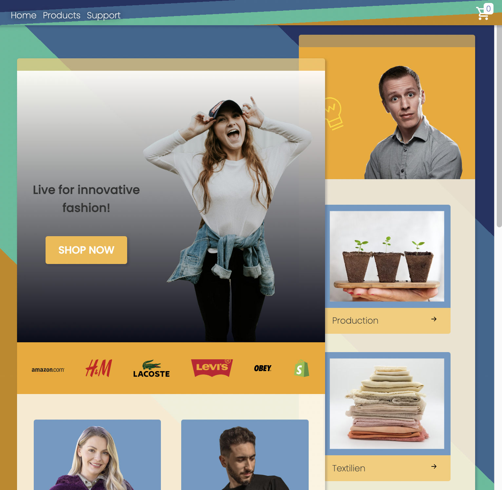
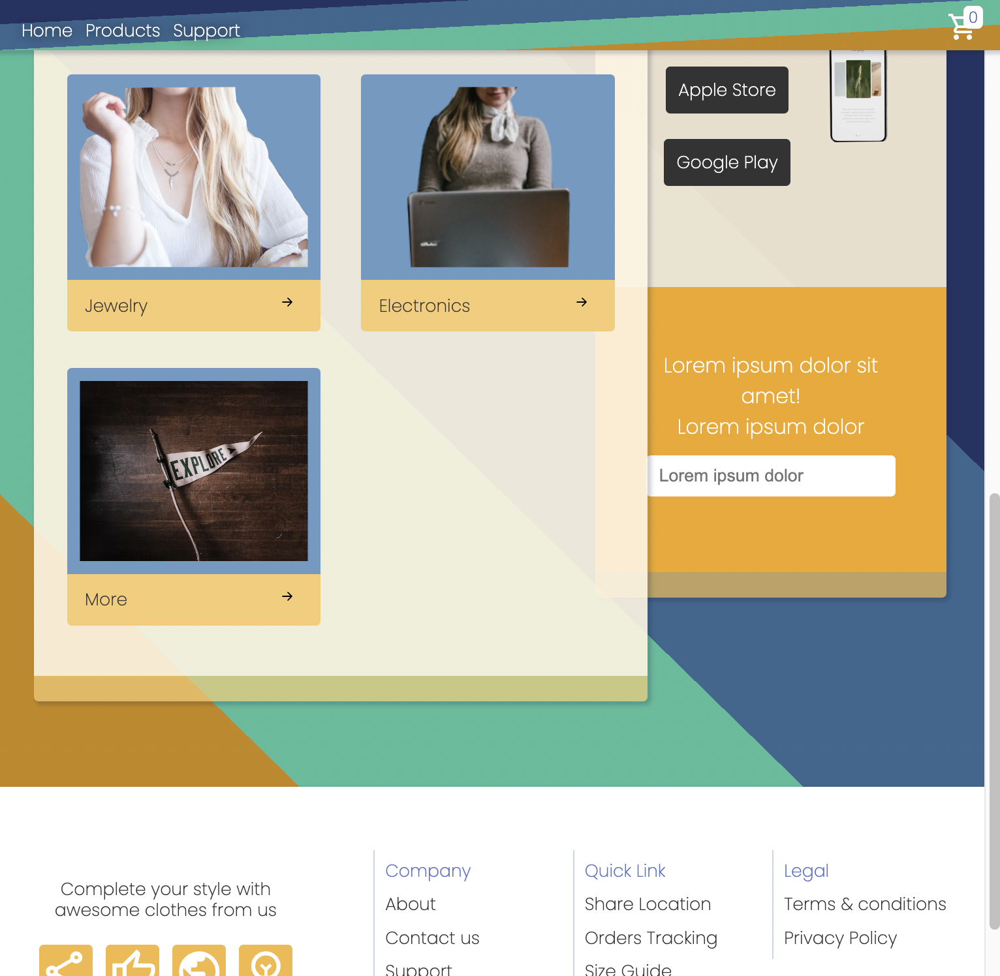
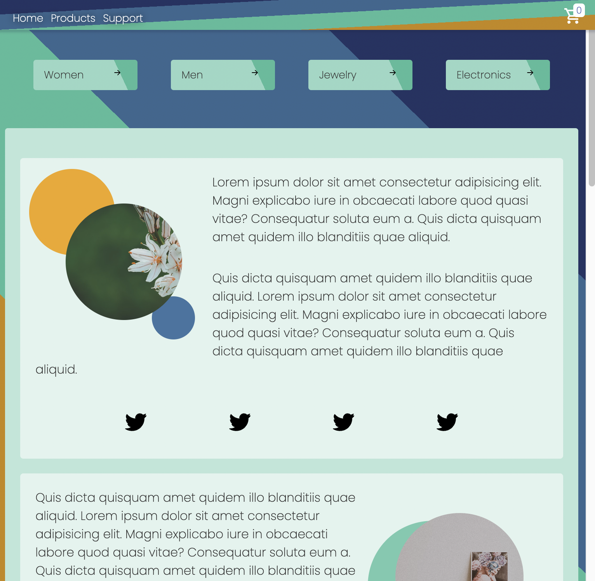
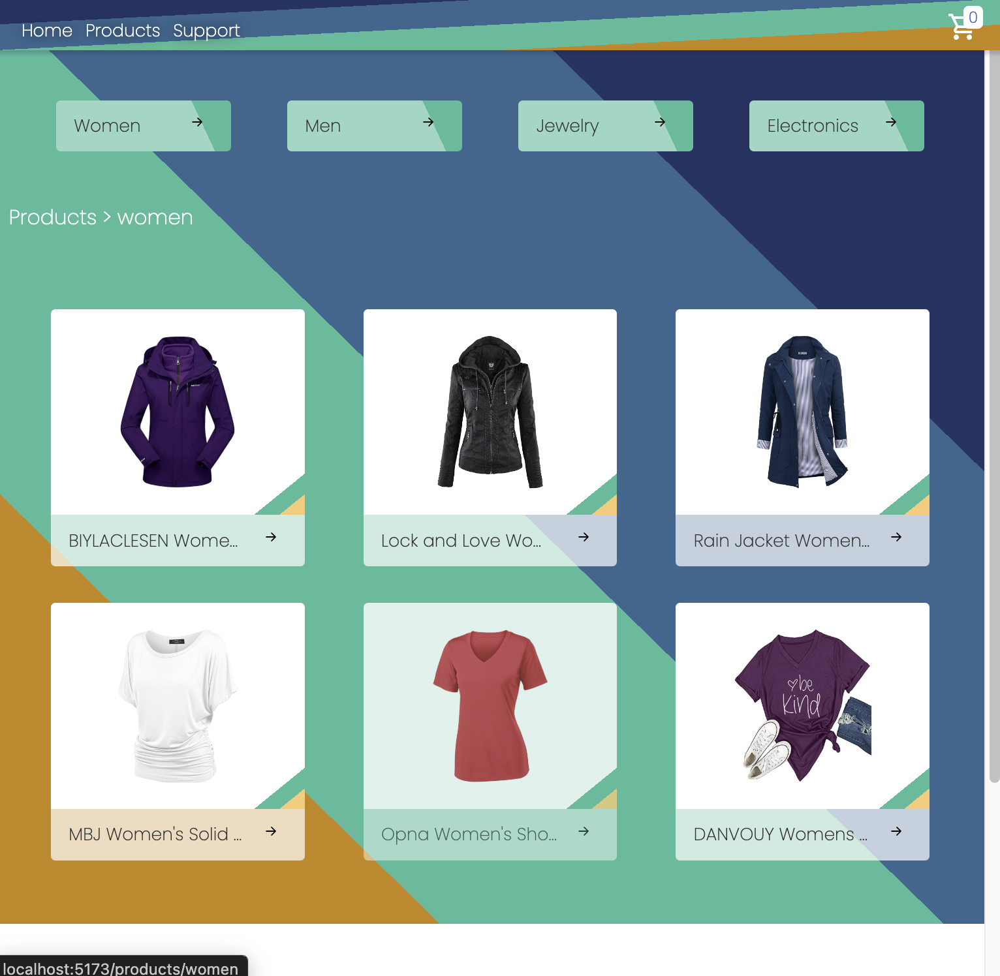
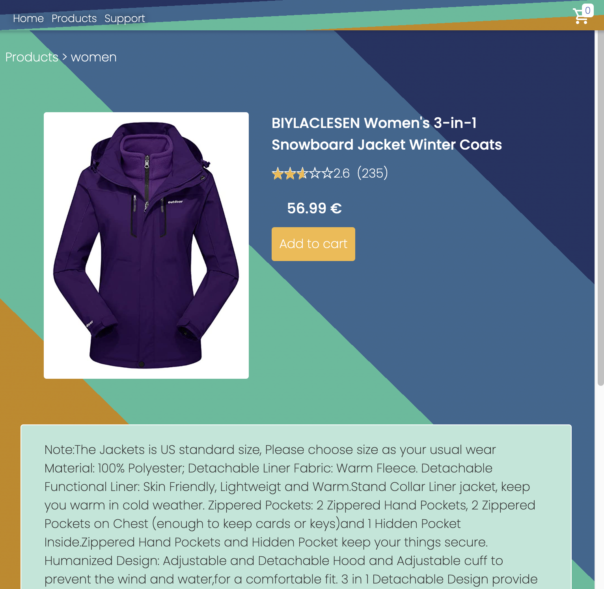
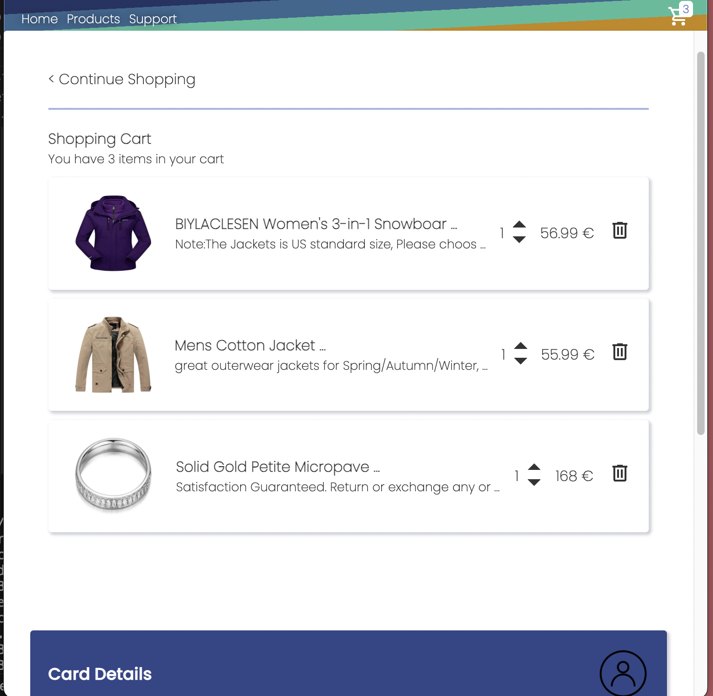
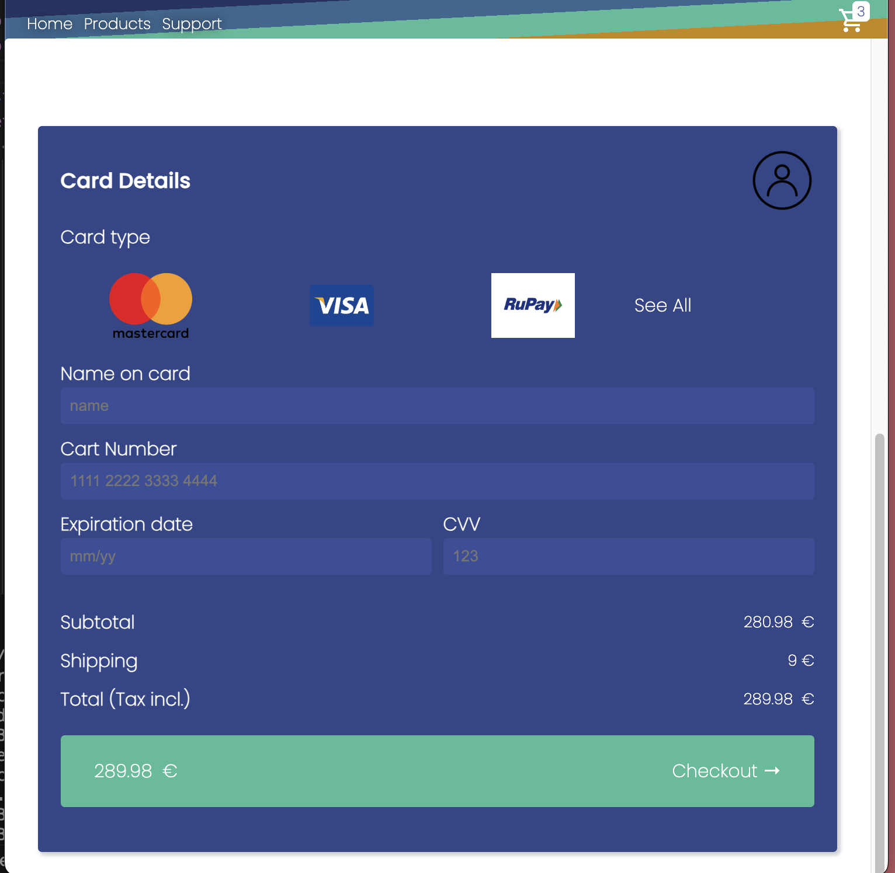

# Amazing-Shop App
## Frontend-Projekt mit React & SASS

## Features

- Produktkategorien
- Produkte in den Warenkorb legen, Menge anpassen oder entfernen
- Gesamtkosten der Produkte im Warenkorb dynamisch anzeigen
- Aktuelle Anzahl der Artikel im Warenkorb im Header sichtbar
- Responsive Design
- Datenabruf mit Fetch API
- Navigation mit React Router
- Zustandsverwaltung mit Context API

## Projekt Zeitraum

Hauptentwicklungsphase: 05.01.2025 – 19.01.2025
Weiterentwicklung & Optimierungen: Nach Bedarf

## Über das Projekt

Dieses Projekt habe ich entwickelt, nachdem ich das Frontend-Single-Page-Application-Modul bei der DCI absolviert habe. Bei neuen Projekten achte ich darauf, nicht nur die erlernten Technologien anzuwenden, sondern auch zusätzliche Technologien zu integrieren, die zwar nicht im Curriculum enthalten sind, aber dennoch wichtig sind. In diesem Fall habe ich SASS verwendet.

Besonderen Wert habe ich auf die Responsiveness der Seite gelegt, um eine optimale Darstellung auf verschiedenen Geräten sicherzustellen.

Während der Entwicklung habe ich mich intensiv mit dem React-Framework und den damit verbundenen Technologien wie der Fetch API, der Context API und React Router auseinandergesetzt.

Aufgrund des vorgegebenen Zeitrahmens konnten nicht alle Features einer vollständigen Shopping-Website umgesetzt werden (zum Beispiel die Bezahlfunktion). Dennoch habe ich durch die Entwicklung der **Amazing-Shop-App** wertvolle praktische Erfahrungen mit React gesammelt und bin nun bestens darauf vorbereitet, noch größere und komplexere Projekte umzusetzen.

## Technologien

- React
- Sass
- Fetch API
- Context API
- React Router

## Preview

 

 

 

 

 

 

